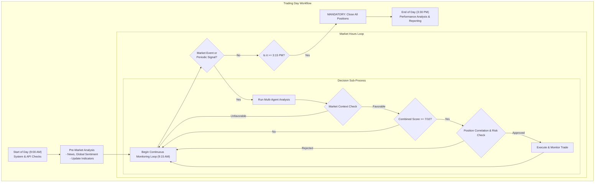

# Intelligent Trading Agent System - Project Plan

> **Project Vision**: Build an autonomous trading agent that can analyze a universe of stocks, make informed trading decisions using technical analysis and news sentiment, and execute trades through Angel One API with comprehensive risk management.

## 📋 **Project Overview**

### **Core Objectives (Research-Focused Day Trading)**

- Analyze a CONFIGURABLE universe of stocks with CONFIGURABLE capital
- Focus on 15-minute to 4-hour timeframe strategies (no scalping)
- **MANDATORY**: Close ALL positions before 3:15 PM daily
- Implement "NO TRADE" as a primary option (selectivity over frequency)
- Validate strategy effectiveness through rapid daily feedback loops
- Achieve >70% win rate with average 1:2 risk-reward ratio

### **Key Success Metrics**

- **Financial Performance**: Consistent positive returns with <5% maximum drawdown
- **System Reliability**: >99% uptime during market hours (9:15 AM - 3:30 PM)
- **Risk Compliance**: Zero violations of predefined risk limits
- **Operational Efficiency**: >80% automated decision-making with minimal manual intervention

---

## 🏗️ **System Architecture**

### **Multi-Agent Design Pattern**


### **Agent Responsibilities**

| Agent | Primary Function | Key Capabilities |
|-------|------------------|------------------|
| **Market Research Agent** | News & sentiment analysis | Web search, news scraping, sentiment scoring, event detection |
| **Technical Analysis Agent** | Chart analysis & indicators | Price patterns, technical indicators, support/resistance levels |
| **Risk Management Agent** | Capital protection | Position sizing, stop-loss management, portfolio risk assessment |
| **Execution Agent** | Trade operations | Order placement, execution monitoring, position management |
| **Orchestrator Agent** | Decision coordination | Multi-agent coordination, final trade decisions, workflow management |

---

## 🔄 **Architectural Approach: Hybrid Workflow-Agentic Model**

### **Our Hybrid Approach**

We are adopting a **hybrid model** that combines a structured, auditable workflow with the flexibility of specialized agents. This approach gives us the best of both worlds: the determinism needed for risk management and trade execution, coupled with the adaptability of agents for complex analysis tasks like market research and news sentiment.

### **Core Decision Workflow**



### **Agent Specialization**

```yaml
workflow_agents:
  market_context_agent:
    responsibility: "Analyze market regime, volatility, sector trends"
    inputs: "NIFTY data, VIX, sector performance"
    outputs: "Market regime score (1-10), volatility flag"
    
  technical_analysis_agent:
    responsibility: "Generate technical signals and scores"
    inputs: "Price data, volume, technical indicators"
    outputs: "Technical score (1-10), signal strength, entry/exit levels"
    
  news_sentiment_agent:
    responsibility: "Analyze news sentiment via LLM"
    inputs: "News articles, earnings announcements, events"
    outputs: "Sentiment score (1-10), news impact assessment"
    
  risk_management_agent:
    responsibility: "Position sizing, risk checks, portfolio limits"
    inputs: "All previous scores, current positions, available capital"
    outputs: "Position size, risk approval/rejection, stop-loss levels"
    
  orchestrator:
    responsibility: "Coordinate workflow, make final decisions"
    inputs: "All agent outputs"
    outputs: "Final trade decision, execution instructions"
```

---

## 📊 **Data Sources & Analysis Components**

### **Stock Universe (Phase 1)**

The initial stock universe is **fully configurable**. The following list is a suggested starting point based on high liquidity and sector diversity.

```yaml
suggested_stocks:
  - RELIANCE
  - TCS
  - HDFCBANK
  - INFY
  - ITC
  - SBIN
  - HCLTECH
  - LT
  - WIPRO
  - MARUTI
```

*Selection Criteria: High liquidity, diverse sectors, consistent volume, well-established companies.*

### **Technical Analysis Stack**

- **Primary Library**: TA-Lib (industry standard)
- **Backup Library**: pandas-ta (Python-native)
- **Data Sources**: Angel One API (primary), Yahoo Finance (backup)

#### **Indicator Categories**

| Category | Indicators | Purpose |
|----------|------------|---------|
| **Trend** | SMA, EMA, MACD, ADX | Identify market direction |
| **Momentum** | RSI, Stochastic, Williams %R | Overbought/oversold conditions |
| **Volatility** | Bollinger Bands, ATR | Risk assessment and position sizing |
| **Volume** | OBV, Volume Profile | Confirm price movements |
| **Support/Resistance** | Pivot Points, Fibonacci | Entry/exit levels |

### **News & Sentiment Analysis**

#### **Data Sources**

- **Primary**: Economic Times, Business Standard, Moneycontrol
- **Secondary**: Company investor relations, regulatory filings
- **Social**: Twitter/X sentiment (trending analysis)

#### **Sentiment Processing Pipeline**

```
Raw News → Text Preprocessing → Sentiment Scoring → Impact Assessment → Signal Generation
```

---

## 🛡️ **Risk Management Framework**

### **Financial Guardrails (Configurable)**

| Risk Parameter | Default | Config Location | Rationale |
|----------------|---------|-----------------|-----------|
| **Stock Universe Size** | 10 stocks | `config.universe_size` | Research focus |
| **Starting Capital** | ₹10,000 | `config.capital` | Research validation |
| **Max Position Size** | 20% of capital | `config.max_position_pct` | Diversification |
| **Daily Loss Limit** | 3% of capital | `config.daily_loss_limit` | Capital preservation |
| **Max Daily Trades** | 3 trades | `config.max_daily_trades` | Quality over quantity |
| **Cooling Period** | 60 minutes | `config.cooling_period_min` | Emotional reset |
| **EOD Closure Time** | 3:15 PM | `config.eod_closure_time` | Day trading mandate |
| **No Trade Threshold** | Signal < 7/10 | `config.min_signal_score` | Selectivity enforcement |

### **Enhanced Operational Guardrails**

| Control | Implementation | Purpose |
|---------|----------------|---------|
| **Morning Setup Window** | 9:00-9:30 AM | System prep, no trades |
| **Active Trading Hours** | 9:30 AM - 3:15 PM | Core trading window |
| **Position Monitoring** | Every 5 minutes | Adequate for 15min+ timeframe |
| **Mandatory EOD Closure** | 3:15 PM sharp | Research consistency |
| **Weekend Position Check** | Ensure zero positions | Validation safety |

### **System Guardrails**

| Safety Measure | Implementation | Trigger |
|----------------|----------------|---------|
| **Human Override** | Manual stop button | Any time intervention needed |
| **Emergency Stop** | Auto-shutdown on major loss | 10% portfolio loss |
| **API Rate Limiting** | Request throttling | Prevent API abuse |
| **Data Validation** | Input sanitization | Corrupt data protection |

### **Capital Allocation Research**

- **Kelly Criterion**: Optimal position sizing based on win rate/payoff
- **Volatility Targeting**: Adjust position size based on stock volatility
- **Drawdown Management**: Reduce size after consecutive losses

---

## 🎯 **Key Trading Considerations**

### **1. Market Microstructure & Timing**

```yaml
trading_timing:
  avoid_first_15_min: true  # Opening volatility
  avoid_last_15_min: true   # Closing effects
  lunch_hour_caution: 12:00-13:30  # Low volume period
  optimal_windows:
    - 10:00-11:30  # Post-opening stability
    - 14:00-15:15  # Pre-close activity
```

### **2. Correlation & Portfolio Heat Map**

- **Sector Clustering**: Don't trade multiple banks/IT stocks simultaneously
- **Beta Correlation**: In high volatility, avoid multiple high-beta stocks
- **Event Clustering**: Avoid trading before RBI meetings, budget announcements

### **3. Trade Setup Quality Scoring**

```yaml
setup_quality_filters:
  minimum_score: 7/10  # Below this = NO TRADE
  confluence_factors:
    - technical_signals: weight=40%
    - volume_confirmation: weight=20%
    - news_sentiment: weight=20%
    - market_context: weight=20%
```

---

## 🌡️ **Market Context & Regime Detection**

### **Daily Market Assessment**

```yaml
market_context_check:
  nifty_trend: trending_up | trending_down | sideways
  volatility_regime: low(<15%) | normal(15-25%) | high(>25%)
  market_breadth: bullish(>60%) | neutral(40-60%) | bearish(<40%)
  sector_leadership: IT | Banking | Pharma | Auto | FMCG
  
trade_adjustments:
  high_volatility:
    - reduce_position_size: 50%
    - wider_stops: +1%
    - avoid_earnings_stocks: true
  
  sideways_market:
    - prefer_mean_reversion: true
    - avoid_breakout_trades: true
    - target_range_bound_stocks: true
```

### **News & Event Risk Matrix**

| Event Type | Action | Timeframe |
|------------|--------|-----------|
| **Earnings Announcement** | No new positions | Day of announcement |
| **RBI Policy Meeting** | Reduce to 50% capital | Meeting day |
| **Budget/Economic Data** | No trades 1 hour before/after | Event window |
| **Global Market Crash** | Emergency stop all trading | Until stability |
| **Circuit Breaker Hit** | No new trades | Rest of session |

---

## 🔄 **Operational Workflows**

### **Daily Trading Cycle**

#### **Pre-Market (9:00-9:15 AM)**

1. **Environment Setup**
   - System health checks
   - API connectivity verification
   - Risk parameter validation

2. **Market Preparation**
   - Overnight news analysis for all 10 stocks
   - Technical indicator updates
   - Global market sentiment assessment
   - Daily risk budget allocation

#### **Market Hours (9:15 AM - 3:30 PM)**

1. **Continuous Monitoring Loop** (Every 1-5 minutes)

   ```
   Data Ingestion → Multi-Agent Analysis → Risk Assessment → Decision Making → Execution → Monitoring
   ```

2. **Event-Driven Processing**
   - News event detection and rapid analysis
   - Technical breakout/breakdown signals
   - Risk threshold breaches
   - Order fill confirmations

#### **Post-Market (3:30-5:00 PM)**

1. **Performance Analysis**
   - Daily P&L calculation
   - Trade performance review
   - Risk metric assessment
   - Strategy effectiveness evaluation

2. **System Maintenance**
   - Data backup and logging
   - System optimization
   - Next-day preparation

### **Decision Making Process**

The decision-making logic is visually represented in the "Core Decision Workflow" diagram under the **Architectural Approach** section. This workflow integrates multi-agent analysis with strict risk management checks to arrive at a final trade decision. The key stages include:

1. **Market Context Analysis**: Assessing overall market conditions before considering any trade.
2. **Multi-Agent Scoring**: Combining technical, sentiment, and risk scores.
3. **Correlation & Risk Approval**: Ensuring new positions are diversified and within capital limits.
4. **Execution & Monitoring**: Placing the trade and continuously monitoring it until the end-of-day closure.

---

## 🎛️ **Technology Stack (Research-Focused & Simplified)**

### **Core Framework**

- **Agent Orchestration**: LangGraph for multi-agent workflows
- **Database**: Supabase PostgreSQL for trade history and analytics
- **Configuration**: YAML files for easy parameter changes
- **Environment**: Python 3.9+ with virtual environment

### **Data & Analysis**

- **Technical Analysis**: pandas-ta (primary choice for research)
- **Market Data**: Angel One API (primary), Yahoo Finance (backup)
- **Data Processing**: pandas, numpy for data manipulation
- **News & Sentiment**: LLM-based analysis (Gemini/Claude) instead of separate NLP libraries

### **Market Intelligence**

- **News Sources**: MCP integrations for investing sites (instead of web scraping)
- **Market Data**: Angel One MCP server (already built)
- **Economic Data**: MCP connectors for financial data providers
- **Sentiment Analysis**: Direct LLM prompts for news interpretation

### **Infrastructure (Minimal)**

- **Trading API**: Angel One MCP server
- **Dashboard**: React (future priority - Phase 3)
- **Logging**: Python's built-in logging module
- **Monitoring**: Simple file-based logs and daily reports
- **Alerting**: Basic email notifications for critical events

### **Development Tools**

- **Backtesting**: pandas-based historical analysis
- **Configuration Management**: YAML files with validation
- **Testing**: pytest for unit tests
- **Version Control**: Git with structured commit messages

---

## 🚧 **Development Roadmap (Research-Focused)**

### **Phase 1: Core Foundation (Weeks 1-2)**

#### **Essential Infrastructure**

- [ ] Supabase PostgreSQL setup for trade logging
- [ ] YAML configuration system implementation
- [ ] pandas-ta technical analysis integration
- [ ] Basic LLM-powered news sentiment analysis
- [ ] Core risk management rules (configurable)
- [ ] Paper trading validation

#### **Week 1-2 Deliverables**

- Angel One MCP server (already built) integration
- 5-7 key technical indicators working
- Basic LLM news analysis (Gemini/Claude)
- Configurable risk parameters
- Paper trading with daily P&L tracking

### **Phase 2: Intelligence & Validation (Weeks 3-5)**

#### **Multi-Agent System**

- [ ] LangGraph orchestration setup
- [ ] Market Context Agent (regime detection)
- [ ] Technical Analysis Agent (signal scoring)
- [ ] Risk Management Agent (position sizing)
- [ ] Decision Orchestrator Agent
- [ ] Historical backtesting on 3-month data

#### **Week 3-5 Deliverables**

- Working multi-agent decision system
- 7/10 signal scoring methodology
- Market regime detection (trending/sideways/volatile)
- 3-month historical validation results
- Daily performance analytics

### **Phase 3: Live Trading & Monitoring (Weeks 6-8)**

#### **Production Deployment**

- [ ] Live trading with small capital (₹5,000 initial)
- [ ] Daily EOD position closure automation
- [ ] Performance tracking and reporting
- [ ] Basic React dashboard (optional)
- [ ] Email alerting for critical events
- [ ] Weekly strategy review framework

#### **Week 6-8 Deliverables**

- Live trading system with full safety measures
- 4-week live performance data
- Automated daily reports
- Strategy effectiveness validation
- React dashboard (if time permits)

### **Phase 4: Optimization & Research (Weeks 9+)**

#### **Strategy Enhancement**

- [ ] Parameter optimization based on live results
- [ ] Additional MCP connectors for market data
- [ ] Advanced correlation analysis
- [ ] Kelly Criterion position sizing
- [ ] Multi-timeframe confluence analysis

#### **Research Deliverables**

- Optimized trading parameters
- Market regime adaptation strategies
- Performance attribution analysis
- Strategy scalability assessment
- Research paper/documentation

### **Rapid Iteration Framework**

- **Weekly Strategy Reviews**: What worked/didn't work
- **Parameter Optimization**: A/B test different thresholds
- **Market Adaptation**: Adjust based on changing market conditions

---

## 💡 **Key Technical Considerations (Research-Focused)**

### **Performance Requirements (Simplified)**

- **Decision Speed**: <30 seconds for analysis (adequate for 15min+ timeframes)
- **Data Processing**: Handle 10 stocks with 5-minute monitoring cycles
- **Reliability**: 95% uptime during active trading hours (9:30 AM - 3:15 PM)
- **Research Focus**: Optimize for learning and validation, not production scale

### **Security & Data Management**

- **API Security**: Environment variables for credentials, Angel One rate limits
- **Data Storage**: Supabase PostgreSQL with automated backups
- **Audit Trail**: Basic logging for trade reconstruction and analysis
- **Configuration Management**: Version-controlled YAML files

### **Research Risk Mitigation**

- **Capital Risk**: Start with ₹5,000, scale up only after validation
- **Model Risk**: 3-month backtesting before live deployment
- **Technology Risk**: Simple architecture with minimal dependencies
- **Operational Risk**: Daily manual review and weekly strategy assessment

---

## 📈 **Success Metrics & KPIs (Research Validation)**

### **Financial Performance (Research Goals)**

- **Win Rate**: >70% of trades profitable (quality over quantity)
- **Risk-Reward Ratio**: Average 1:2 or better
- **Maximum Drawdown**: <3% during research phase
- **Daily Consistency**: Positive days >60% of trading days
- **Strategy Edge**: Outperform buy-and-hold by >5% annually

### **Research Validation Metrics**

- **Signal Quality**: 7/10+ scoring system working effectively
- **No-Trade Accuracy**: >80% of avoided trades were correct decisions
- **Market Regime Adaptation**: Performance consistency across different market conditions
- **Parameter Sensitivity**: Strategy robust to small parameter changes
- **Backtest vs Live**: <20% performance degradation from backtest to live
- **Daily Win Rate**: Track per-day success
- **Strategy Decay**: Monitor if edge diminishes over time

### **Operational Research Goals**

- **System Reliability**: 95% uptime during trading hours
- **Data Quality**: <1% data processing errors
- **Risk Compliance**: 100% adherence to EOD closure and risk limits
- **Learning Speed**: Weekly strategy improvements based on performance data
- **Documentation**: Complete audit trail for all trading decisions

---
